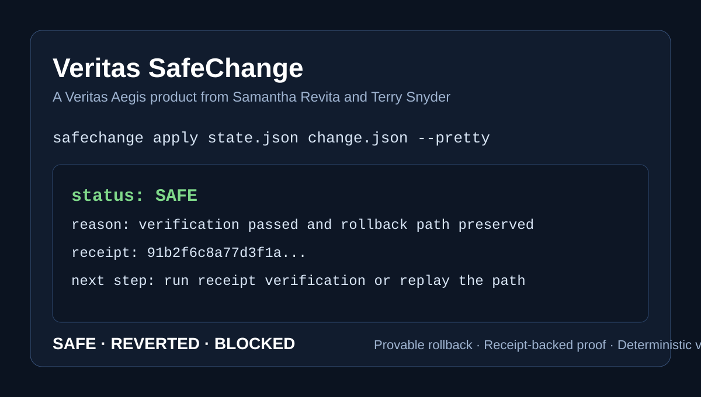

# Veritas SafeChange

**Veritas SafeChange** is a **Veritas Aegis** product from **Samantha Revita** and **Terry Snyder**.

It puts a governed boundary around risky production change so a a change is only allowed to exist if it can be applied, verified, and cleanly reversed 
**Human-facing outcomes**
- **SAFE** — the change landed and held
- **REVERTED** — the change was undone cleanly after verification failed
- **BLOCKED** — the path could not proceed safely



## What buyers are buying

We enforce the moment a change becomes real.

A hard control point for risky change:

> **Can this land safely — and can it be reversed cleanly if it should not remain real?**

That control point produces:
- receipt-backed proof
- deterministic audit verification
- a clean SAFE / REVERTED / BLOCKED answer
- a fail-closed path when trust breaks

## Where it fits

Use **Veritas SafeChange** when you have:
- rollback-sensitive releases
- risky config or deploy steps
- upgrade paths with irreversible side effects
- delivery flows where proof matters more than optimism

## How it works

```text
snapshot → apply → verify → held or reversed → receipt → replay / audit verification
```

## Start in 3 minutes

```bash
pip install veritas-safechange

safechange apply examples/state.json examples/change.json \
  --state-kind json \
  --require status \
  --audit audit.jsonl \
  --pretty

safechange verify-audit audit.jsonl --pretty
```

See [QUICKSTART.md](QUICKSTART.md) for the shortest run path.

## Commercial lanes

### Community
Self-serve evaluation for local and CI use.

### Paid Pilot
One bounded risky path, one support window, one clear conversion decision.  
**Typical paid pilots start at USD 7,500** for one defined path.

### Commercial
Licensed use, support, and integration help after a successful pilot.

See:
- [ONE_PAGE.md](ONE_PAGE.md)
- [PILOT.md](PILOT.md)
- [COMMERCIAL.md](COMMERCIAL.md)
- [USE_CASES.md](USE_CASES.md)
- [CONTACT.md](CONTACT.md)

## Contact

**Veritas Aegis**  
**Samantha Revita + Terry Snyder**  
Product / pilot / commercial inquiries: **canarybird0618@gmail.com**

**Veritas SafeChange** is part of the **Veritas Aegis** product family.
